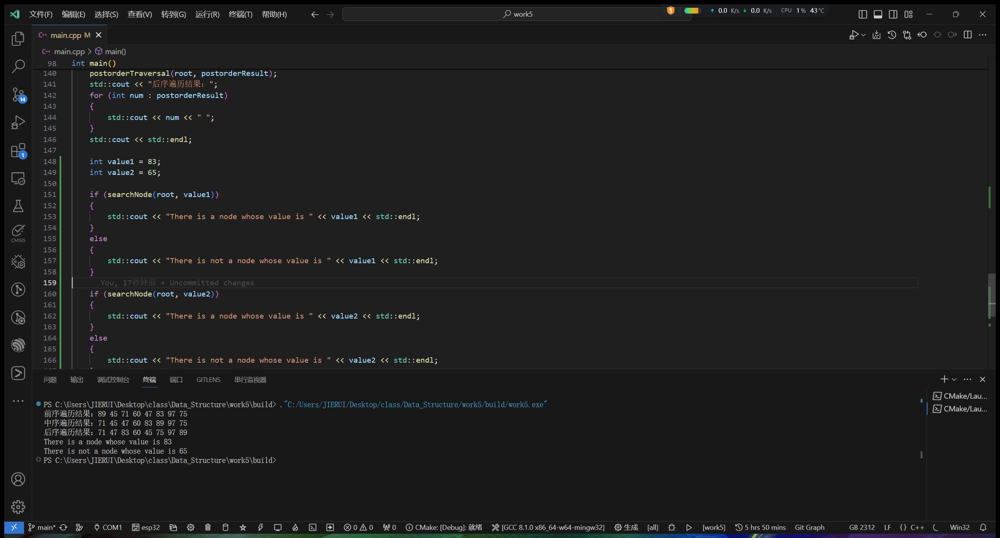

# Data_Structure

# 算法与数据结构实验报告

## 实验1:单链表的建立

### 要求

- 建立一个单链表，并遍历单链表
- 对(1)中的程序，增加几个语句，计算所建立单链表的
长度，并在屏幕上输出该长度的值。
- 建立一个单链表，并遍历该单链表。然后，增加几个语句，删除单链表中的所有结点，使之成为
一个空表。

### 实验思路

1. 建立一个单链表，并遍历单链表：
    - 创建一个头节点，并将其指针指向第一个数据节点。
    - 通过循环，依次创建数据节点，并将前一个节点的指针指向当前节点。
    - 遍历链表，输出每个节点的值。

2. 计算单链表的长度并输出：
    - 使用一个计数器变量，初始化为0。
    - 遍历链表，每经过一个节点，计数器加1。
    - 输出计数器的值，即为链表的长度。

3. 删除单链表中的所有节点，使之成为空表：
    - 使用一个指针变量，指向链表的头节点。
    - 通过循环，依次删除每个节点，直到链表为空。
    - 最后将头节点的指针置空，表示链表为空表。

### 代码块

```c
#include <iostream>
// 定义链表的结点结构体,每一个结点包含当前元素和下一个结点的地址
struct Node
{
    int data;
    Node *next;
};
/**
 * @brief 遍历链表
 *
 * @param head 链表头结点
 */
void traverseLinkedList(Node *head)
{
    Node *current = head;
    while (current != nullptr) // 当前结点非空
    {
        std::cout << current->data << " ";
        current = current->next;
    }
    std::cout << std::endl;
}
/**
 * @brief 计算链表的长度
 *
 * @param head 链表头结点
 * @return int 链表长度
 */
int calculateLinkedListLength(Node *head)
{
    int length = 0;
    Node *current = head;
    while (current != nullptr)
    {
        length++;                // 长度自增
        current = current->next; // 指针指向下一个结点
    }
    return length;
}
/**
 * @brief 删除链表的所有结点
 *
 * @param head 链表头结点
 */
void deleteLinkedList(Node *&head)
{
    Node *current = head;
    while (current != nullptr)
    {
        Node *temp = current;
        current = current->next; // 指针指向下一个结点
        delete temp;
    }
    head = nullptr;
}

int main()
{
    Node *head = nullptr;

    // 建立一个单链表
    Node *node1 = new Node;
    node1->data = 1;
    node1->next = nullptr;
    head = node1;

    Node *node2 = new Node;
    node2->data = 2;
    node2->next = nullptr;
    node1->next = node2;

    Node *node3 = new Node;
    node3->data = 3;
    node3->next = nullptr;
    node2->next = node3;

    // 遍历链表
    std::cout << "Traverse the linked list:" << std::endl; // 第一次遍历
    traverseLinkedList(head);

    // 计算链表的长度
    int length = calculateLinkedListLength(head);
    std::cout << "Length of the linked list: " << length << std::endl;

    // 删除链表的所有结点
    deleteLinkedList(head);

    std::cout << "Traverse the linked list:" << std::endl; // 删除所有结点后遍历
    traverseLinkedList(head);

    // 计算链表的长度
    int length1 = calculateLinkedListLength(head);
    std::cout << "Length of the linked list: " << length1 << std::endl;
    return 0;
}
```

### 实验输出结果


## 实验2:单链表的插入

### 要求

依次从键盘上输入六个整数:34,55,66,78,31,59.

- 建立一个单链表，把这六个数依次保存到一个单链表中、
输出遍历单链表。
- 在单链表的表头添加一个元素75、输出遍历单链表。
- 在单链表的表尾添加一个元素41、输出遍历单链表。

### 实验思路

单链表的插入操作可以分为三个步骤：<br />

1. 找到要插入位置的前一个节点;<br />
2. 创建一个新节点，并将要插入的值赋给新节点的数据域;<br />
3. 将新节点的next指针指向前一个节点的next指针所指向的节点，然后将前一个节点的next指针指向新节点;<br />

具体插入操作如下：<br />

1. 在表头插入元素:
    - 检查链表是否为空,如果为空直接返回。
    - 创建一个新节点，并将要插入的值赋给新节点的数据域。
    - 将新节点的next指针指向原来的头节点,将新节点设置为新的头节点。
2. 在表尾插入元素:

    - 检查链表是否为空,如果为空直接返回。
    - 遍历链表，直到找到最后一个节点。
    - 创建一个新节点，并将要插入的值赋给新节点的数据域。
    - 将最后一个节点的next指针指向新节点，将新节点设置为新的最后一个节点。

### 代码块

```c
#include <iostream>
// 单链表的节点结构体,即一个节点包含数据和指向下一个节点的指针
struct Node
{
    int data;
    Node *next;
};
/**
 * @brief 遍历单链表
 *
 * @param head 单链表的头指针
 */
void traverseLinkedList(Node *head)
{
    Node *current = head;
    while (current != nullptr)
    {
        std::cout << current->data << " "; // 输出当前节点的数据,并换行
        current = current->next;           // 将current指向下一个节点
    }
    std::cout << std::endl; // 借助std::endl换行
}
/**
 * @brief 向单链表的表头添加一个元素
 *
 * @param head 单链表的头指针
 * @param value 要添加的元素
 */
void insertAtHead(Node *&head, int value)
{
    Node *newNode = new Node();
    newNode->data = value; // 将新节点的数据域赋值为value
    newNode->next = head;  // 将新节点的next指针指向原来的头节点
    head = newNode;
}
/**
 * @brief 向单链表的表尾添加一个元素
 *
 * @param head 单链表的头指针
 * @param value 要添加的元素
 */
void insertAtTail(Node *&head, int value)
{
    Node *newNode = new Node();
    newNode->data = value;   // 将新节点的数据域赋值为value
    newNode->next = nullptr; // 将新节点的next指针置空

    if (head == nullptr) // 如果为空链表，直接将新节点作为头节点
    {
        head = newNode;
    }
    else
    {
        Node *current = head;
        while (current->next != nullptr)
        {
            current = current->next;
        }
        current->next = newNode; // 将新节点添加到最后一个节点的后面
    }
}

/**
 * @brief 删除单链表的表头元素
 *
 * @param head 单链表的头指针
 */
void deleteAtHead(Node *&head)
{
    if (head == nullptr) // 如果为空链表，直接返回
    {
        return;
    }

    Node *temp = head; // 保存要删除的节点的地址
    head = head->next; // 头指针指向下一个节点
    delete temp;       // release原来的头节点
}

/**
 * @brief 删除单链表的表尾元素
 *
 * @param head 单链表的头指针
 */
void deleteAtTail(Node *&head)
{
    if (head == nullptr) // 如果为空链表，直接返回
    {
        return;
    }

    if (head->next == nullptr) // 如果只有一个节点，直接删除
    {
        delete head;
        head = nullptr;
        return;
    }

    Node *current = head;
    while (current->next->next != nullptr) // 找到倒数第二个节点
    {
        current = current->next;
    }
    delete current->next;    // 删除最后一个节点
    current->next = nullptr; // 将倒数第二个节点的next指针置空
}

/**
 * @brief 删除单链表中指定元素
 *
 * @param head 单链表的头指针
 * @param value 要删除的元素
 */
void deleteElement(Node *&head, int value)
{
    if (head == nullptr) // 如果为空链表，直接返回
    {
        return;
    }

    // 如果要删除的元素是头节点
    if (head->data == value)
    {
        deleteAtHead(head);//直接删除头结点并返回
        return;
    }

    Node *current = head;//临时结点,用于保存当前结点的地址
    Node *previous = nullptr;//临时结点，用于保存当前结点的前驱结点地址

    // 遍历链表查找要删除的元素
    while (current != nullptr && current->data != value)//当链表不为空且当前结点的数据域不等于value,继续向后遍历
    {
        previous = current;
        current = current->next;
    }

    // 如果找到要删除的元素
    if (current != nullptr)
    {
        previous->next = current->next;//将当前结点的前驱结点的next指针指向当前结点的后继结点
        delete current;//删除当前结点,即删除指定元素
    }
}

int main()
{
    Node *head = nullptr; // 单链表的头指针,先初始化为nullptr

    // 从键盘上读取六个整数，并依次保存到单链表中
    printf("plese enter six number:\n");
    for (int i = 0; i < 6; i++)
    {
        int num;
        std::cin >> num;
        insertAtTail(head, num); // 在单链表的表尾添加元素
    }

    // 输出遍历单链表
    printf("Traverse the linked list::\n");
    traverseLinkedList(head);

    printf("Add an element 75 to the header of the list:\n");
    // 删除表头的一个元素
    insertAtHead(head,75);
    // 输出遍历单链表
    traverseLinkedList(head);


    printf("Add an element 41 to the footer of the list:\n");
    // 删除单链表表尾的一个元素
    insertAtTail(head,41);
    // 输出遍历单链表
    traverseLinkedList(head);

    return 0;
}
```

### 实验输出结果


## 实验3:单链表的删除

### 要求

依次从键盘上输入六个整数：34,55,66,78,31,59.

- 建立一个单链表，把这六个数依次保存到一个单链表中,输出遍历单链表。
- 删除单链表中的表头元素、输出遍历单链表。
- 删除单链表中的表尾元素、输出遍历单链表。
- 删除单链表中值为78的元素、输出遍历单链表。

### 实验思路

与单链表的插入思路类似,单链表的别除思路如下：<br />

1. 删除头节点：
    - 检查链表是否为空，如果为空则直接返回。
    - 保存头节点的地址到一个临时指针变量。
    - 将头指针指向下一个节点。
    - 释放临时指针变量所指向的节点的内存。
2. 删除尾节点：
    - 检查链表是否为空，如果为空则直接返回。
    - 检查链表是否为空，如果为空则直接返回。
    - 如果链表只有一个节点，直接删除头节点并返回。
    - 找到倒数第二个节点，即遍历链表直到当前节点的下一个节点的下一个节点为空。
3. 删除指定元素的结点:

    - 检查链表是否为空，如果为空则直接返回。
    - 如果要删除的元素是头节点：
        - 保存头节点的地址到一个临时指针变量。
        - 将头指针指向下一个节点。
        - 释放临时指针变量所指向的节点的内存。
    - 如果要删除的元素非头节点：
        - 遍历链表查找要删除的元素：
        - 使用两个指针变量，一个指向当前节点，一个指向当前节点的前驱节点。
        - 遍历链表，直到找到要删除的元素或者到达链表末尾。
        - 如果找到要删除的元素,将前驱节点的next指针指向当前节点的后继节点。
        - 释放临时指针变量所指向的当前节点的内存。

### 代码块

```c
#include <iostream>
// 单链表的节点结构体,即一个节点包含数据和指向下一个节点的指针
struct Node
{
    int data;
    Node *next;
};
/**
 * @brief 遍历单链表
 *
 * @param head 单链表的头指针
 */
void traverseLinkedList(Node *head)
{
    Node *current = head;
    while (current != nullptr)
    {
        std::cout << current->data << " "; // 输出当前节点的数据,并换行
        current = current->next;           // 将current指向下一个节点
    }
    std::cout << std::endl; // 借助std::endl换行
}
/**
 * @brief 向单链表的表头添加一个元素
 *
 * @param head 单链表的头指针
 * @param value 要添加的元素
 */
void insertAtHead(Node *&head, int value)
{
    Node *newNode = new Node();
    newNode->data = value; // 将新节点的数据域赋值为value
    newNode->next = head;  // 将新节点的next指针指向原来的头节点
    head = newNode;
}
/**
 * @brief 向单链表的表尾添加一个元素
 *
 * @param head 单链表的头指针
 * @param value 要添加的元素
 */
void insertAtTail(Node *&head, int value)
{
    Node *newNode = new Node();
    newNode->data = value;   // 将新节点的数据域赋值为value
    newNode->next = nullptr; // 将新节点的next指针置空

    if (head == nullptr) // 如果为空链表，直接将新节点作为头节点
    {
        head = newNode;
    }
    else
    {
        Node *current = head;
        while (current->next != nullptr)
        {
            current = current->next;
        }
        current->next = newNode; // 将新节点添加到最后一个节点的后面
    }
}

/**
 * @brief 删除单链表的表头元素
 *
 * @param head 单链表的头指针
 */
void deleteAtHead(Node *&head)
{
    if (head == nullptr) // 如果为空链表，直接返回
    {
        return;
    }

    Node *temp = head; // 保存要删除的节点的地址
    head = head->next; // 头指针指向下一个节点
    delete temp;       // release原来的头节点
}

/**
 * @brief 删除单链表的表尾元素
 *
 * @param head 单链表的头指针
 */
void deleteAtTail(Node *&head)
{
    if (head == nullptr) // 如果为空链表，直接返回
    {
        return;
    }

    if (head->next == nullptr) // 如果只有一个节点，直接删除
    {
        delete head;
        head = nullptr;
        return;
    }

    Node *current = head;
    while (current->next->next != nullptr) // 找到倒数第二个节点
    {
        current = current->next;
    }
    delete current->next;    // 删除最后一个节点
    current->next = nullptr; // 将倒数第二个节点的next指针置空
}

/**
 * @brief 删除单链表中指定元素
 *
 * @param head 单链表的头指针
 * @param value 要删除的元素
 */
void deleteElement(Node *&head, int value)
{
    if (head == nullptr) // 如果为空链表，直接返回
    {
        return;
    }

    // 如果要删除的元素是头节点
    if (head->data == value)
    {
        deleteAtHead(head);
        return;
    }

    Node *current = head;
    Node *previous = nullptr;

    // 遍历链表查找要删除的元素
    while (current != nullptr && current->data != value)
    {
        previous = current;
        current = current->next;
    }

    // 如果找到要删除的元素
    if (current != nullptr)
    {
        previous->next = current->next;
        delete current;
    }
}

int main()
{
    Node *head = nullptr; // 单链表的头指针,先初始化为nullptr

    // 从键盘上读取六个整数，并依次保存到单链表中
    printf("plese enter six number:\n");
    for (int i = 0; i < 6; i++)
    {
        int num;
        std::cin >> num;
        insertAtTail(head, num); // 在单链表的表尾添加元素
    }

    // 输出遍历单链表
    printf("Traverse the linked list::\n");
    traverseLinkedList(head);

    printf("Delete an element to the header of the list:\n");
    // 删除表头的一个元素
    deleteAtHead(head);
    // 输出遍历单链表
    traverseLinkedList(head);


    printf("Delete an element to the footer of the list:\n");
    // 删除单链表表尾的一个元素
    deleteAtTail(head);
    // 输出遍历单链表
    traverseLinkedList(head);


    deleteElement(head, 78);
    //删除单链表中指定元素
    printf("Delete an element 78 to the header of the list:\n");
    // 输出遍历单链表
    traverseLinkedList(head);
    return 0;
}
```

### 实验输出结果


## 实验4:单链表的查找

### 要求

编写一个主程序和两个函数，实现如下功能：

- 建立一个具有如下七个元素(80,55,61,51,55,89,
71)的单链表。
- 编写函数分别实现如下的功能。
  - 编写一个函数实现：从单链表中查找出所有元素的
最大值，该值由函数返回，若单链表为空，则显示出错信息并
亭止运行。
  - 编写一个函数实现：统计出单链表中结点的值等于
给定值55的结点个数。
- 对在(1)中所建立的单链表，调用(a)和(b)的这两
个函数，来进行处理。

### 实验思路

- 创建一个单链表，并将给定的七个元素(80,55,61,51,55,89,71)插入到链表中。
- 编写一个函数来查找链表中的最大值:如果链表为空，则直接显示错误信息并停止运行。定义一个临时变量初始化为头元素。遍历链表中的每个节点，将节点的值与当前最大值进行比较，如果节点的值大于当前最大值，则更新最大值。最后返回最大值。如果链表为空，则显示错误信息并停止运行。
- 编写一个函数来统计链表中值等于给定值55的节点个数:遍历链表中的每个节点，如果节点的值等于给定值，则计数器加1。最后返回计数器的值。
- 在主程序中，调用上述两个函数来处理创建的链表:首先调用查找最大值的函数，并将结果打印出来。然后调用统计节点个数的函数，并将结果打印出来。

### 代码块

```c
#include <iostream>
// 单链表的节点结构体,即一个节点包含数据和指向下一个节点的指针
struct Node
{
    int data;
    Node *next;
};
/**
 * @brief 遍历单链表
 *
 * @param head 单链表的头指针
 */
void traverseLinkedList(Node *head)
{
    Node *current = head;
    while (current != nullptr)
    {
        std::cout << current->data << " ";//输出当前节点的数据,并换行
        current = current->next;//将current指向下一个节点
    }
    std::cout << std::endl;//借助std::endl换行
}
/**
 * @brief 向单链表的表头添加一个元素
 *
 * @param head 单链表的头指针
 * @param value 要添加的元素
 */
void insertAtHead(Node *&head, int value)
{
    Node *newNode = new Node();
    newNode->data = value;//将新节点的数据域赋值为value
    newNode->next = head;//将新节点的next指针指向原来的头节点
    head = newNode;
}
/**
 * @brief 向单链表的表尾添加一个元素
 *
 * @param head 单链表的头指针
 * @param value 要添加的元素
 */
void insertAtTail(Node *&head, int value)
{
    Node *newNode = new Node();
    newNode->data = value;//将新节点的数据域赋值为value
    newNode->next = nullptr;//将新节点的next指针置空

    if (head == nullptr)//如果为空链表，直接将新节点作为头节点
    {
        head = newNode;
    }
    else
    {
        Node *current = head;
        while (current->next != nullptr)
        {
            current = current->next;
        }
        current->next = newNode;//将新节点添加到最后一个节点的后面
    }
}

 /**
  * @brief 删除单链表的表头元素
  *
  * @param head 单链表的头指针
  */
 void deleteAtHead(Node *&head)
 {
     if (head == nullptr)//如果为空链表，直接返回
     {
         return;
     }

     Node *temp = head;//保存要删除的节点的地址
     head = head->next;//头指针指向下一个节点
     delete temp;//release原来的头节点
 }

 /**
  * @brief 删除单链表的表尾元素
  *
  * @param head 单链表的头指针
  */
 void deleteAtTail(Node *&head)
 {
     if (head == nullptr)//如果为空链表，直接返回
     {
         return;
     }

     if (head->next == nullptr)//如果只有一个节点，直接删除
     {
         delete head;
         head = nullptr;
         return;
     }

     Node *current = head;
     while (current->next->next != nullptr)//找到倒数第二个节点
     {
         current = current->next;
     }
     delete current->next;//删除最后一个节点
     current->next = nullptr;//将倒数第二个节点的next指针置空
 }

/**
 * @brief 删除单链表中指定元素
 *
 * @param head 单链表的头指针
 * @param value 要删除的元素
 */
void deleteElement(Node *&head, int value)
{
    if (head == nullptr) // 如果为空链表，直接返回
    {
        return;
    }

    // 如果要删除的元素是头节点
    if (head->data == value)
    {
        deleteAtHead(head);
        return;
    }

    Node *current = head;
    Node *previous = nullptr;

    // 遍历链表查找要删除的元素
    while (current != nullptr && current->data != value)
    {
        previous = current;
        current = current->next;
    }

    // 如果找到要删除的元素
    if (current != nullptr)
    {
        previous->next = current->next;
        delete current;
    }
}

/**
 * @brief 从单链表中查找出所有元素的最大值
 *
 * @param head 单链表的头指针
 * @return int 单链表中所有元素的最大值
 */
int findMaxValue(Node *head)
{
    if (head == nullptr) // 如果为空链表，显示出错信息并停止运行
    {
        printf("Error: The linked list is empty\n");
        exit(1);
    }

    int maxValue = head->data;  // 假设第一个元素为最大值
    Node *current = head->next; // 指针指向第二个元素开始遍历

    while (current != nullptr) // 冒泡法遍历链表
    {
        if (current->data > maxValue)
        {
            maxValue = current->data;
        }
        current = current->next;
    }
    return maxValue;
}


/**
 * @brief 统计单链表中值等于给定值的结点个数
 *
 * @param head 单链表的头指针
 * @param value 给定值
 * @return int 值等于给定值的结点个数
 */
int countNodesWithValue(Node *head, int value)
{
    int count = 0;
    Node *current = head;

    while (current != nullptr)
    {
        if (current->data == value)
        {
            count++;
        }
        current = current->next;
    }
    return count;
}


int main()
{
    Node *head = nullptr; // 单链表的头指针,先初始化为nullptr

    // 从键盘上读取六个整数，并依次保存到单链表中
    printf("please enter seven number:\n");
    for (int i = 0; i < 7; i++)
    {
        int num;
        std::cin >> num;
        insertAtTail(head, num);//在单链表的表尾添加元素
    }
    // 输出遍历单链表
    traverseLinkedList(head);

    //查找单链表中所有元素的最大值
    printf("The maximum value of all elements in the is:%d\n", findMaxValue(head));
    printf("The number of 55 in thelist whose value is equal to the given value is:%d\n", countNodesWithValue(head, 55));
    return 0;
}
```

### 实验输出结果


## 实验5:树的处理和操作

### 要求

一个树的结构如下:
<div align="center"> </div>

首先建立八个对应的结点，然后建立该二叉树的链接
存储结构。

- 得到并输出该二叉树的：前序遍历、中序遍历、后序
遍历的结点序列。
- 在该二叉树中查找值分别为83、65的结点，若存在
相应的结点，则输出“<font color=yellow>There is a node whose value is..</font>”，
若不存在相应的结点，则输出“<font color=yellow>There is not a node whose
value is.</font>”。

### 实验思路

- 建立八个对应的结点，并建立二叉树的链接存储结构。可以使用指针来表示每个结点，并通过指针的方式将它们连接起来，形成二叉树的结构。

- 前序遍历是先访问根结点，然后递归地遍历左子树和右子树。
- 中序遍历是先递归地遍历左子树，然后访问根结点，最后递归地遍历右子树。
- 后序遍历是先递归地遍历左子树和右子树，最后访问根结点。

- 在二叉树中查找值分别为83和65的结点。可以使用递归或迭代的方式来实现查找算法,如果找到了相应的结点，则输出"There is a node whose value is..."；如果没有找到相应的结点，则输出"There is not a node whose value is..."。

### 代码块

```c
#include <iostream>
#include <vector>
// 树的结构体
struct TreeNode
{
    int data;        // 数据
    TreeNode *left;  // 左子节点
    TreeNode *right; // 右子节点
};

/**
 * @brief 创建一个二叉树节点
 * @param data 节点数据
 * @return 新创建的节点指针
 */
TreeNode *createNode(int data)
{
    TreeNode *newNode = new TreeNode();
    if (newNode)
    {
        newNode->data = data;
        newNode->left = newNode->right = nullptr;
    }
    return newNode;
}

/**
 * @brief 创建节点之间的链接
 * @param parent 父节点
 * @param leftChild 左子节点
 * @param rightChild 右子节点
 */
void createLink(TreeNode *parent, TreeNode *leftChild, TreeNode *rightChild)
{
    parent->left = leftChild;
    parent->right = rightChild;
}

/**
 * @brief 前序遍历二叉树
 * @param root 根节点
 * @param result 存储遍历结果的向量
 */
void preorderTraversal(TreeNode *root, std::vector<int> &result)
{
    if (root)
    {
        result.push_back(root->data);
        preorderTraversal(root->left, result);
        preorderTraversal(root->right, result);
    }
}

/**
 * @brief 中序遍历二叉树
 * @param root 根节点
 * @param result 存储遍历结果的向量
 */
void inorderTraversal(TreeNode *root, std::vector<int> &result)
{
    if (root)
    {
        inorderTraversal(root->left, result);
        result.push_back(root->data);
        inorderTraversal(root->right, result);
    }
}

/**
 * @brief 后序遍历二叉树
 * @param root 根节点
 * @param result 存储遍历结果的向量
 */
void postorderTraversal(TreeNode *root, std::vector<int> &result)
{
    if (root)
    {
        postorderTraversal(root->left, result);
        postorderTraversal(root->right, result);
        result.push_back(root->data);
    }
}
int searchNode(TreeNode *root, int value)
{
    if (root == nullptr)
    {
        return false;
    }
    if (root->data == value)
    {
        return true;
    }
    bool leftResult = searchNode(root->left, value);
    bool rightResult = searchNode(root->right, value);
    return leftResult || rightResult;
}

int main()
{
    // 创建二叉树的结点数据及对应关系
    TreeNode *root = createNode(89);
    TreeNode *node2 = createNode(45);
    TreeNode *node3 = createNode(97);
    TreeNode *node4 = createNode(71);
    TreeNode *node5 = createNode(60);
    TreeNode *node6 = createNode(75);
    TreeNode *node7 = createNode(47);
    TreeNode *node8 = createNode(83);

    createLink(root, node2, node3);
    createLink(node2, node4, node5);
    createLink(node3, nullptr, node6);
    createLink(node5, node7, node8);

    // 前序遍历
    std::vector<int> preorderResult;
    preorderTraversal(root, preorderResult);
    std::cout << "前序遍历结果：";
    for (int num : preorderResult)
    {
        std::cout << num << " ";
    }
    std::cout << std::endl;


    // 中序遍历
    std::vector<int> inorderResult;
    inorderTraversal(root, inorderResult);
    std::cout << "中序遍历结果：";
    for (int num : inorderResult)
    {
        std::cout << num << " ";
    }
    std::cout << std::endl;


    // 后序遍历
    std::vector<int> postorderResult;
    postorderTraversal(root, postorderResult);
    std::cout << "后序遍历结果：";
    for (int num : postorderResult)
    {
        std::cout << num << " ";
    }
    std::cout << std::endl;

    int value1 = 83;
    int value2 = 65;

    if (searchNode(root, value1))
    {
        std::cout << "There is a node whose value is " << value1 << std::endl;
    }
    else
    {
        std::cout << "There is not a node whose value is " << value1 << std::endl;
    }

    if (searchNode(root, value2))
    {
        std::cout << "There is a node whose value is " << value2 << std::endl;
    }
    else
    {
        std::cout << "There is not a node whose value is " << value2 << std::endl;
    }

    return 0;
}
```

### 实验输出结果


